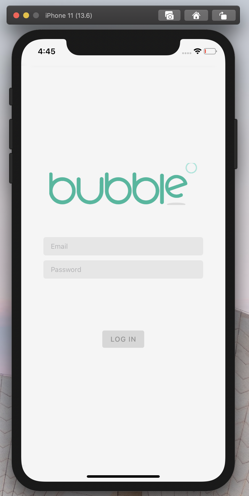
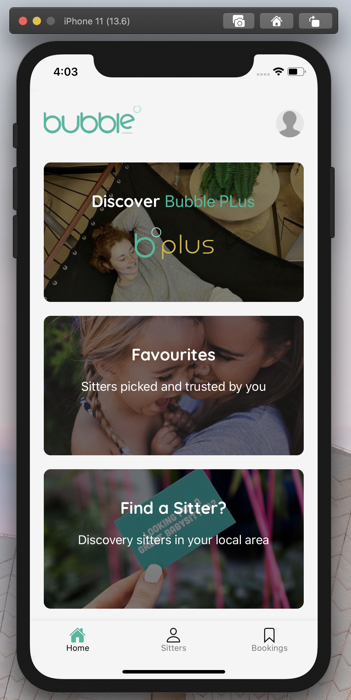
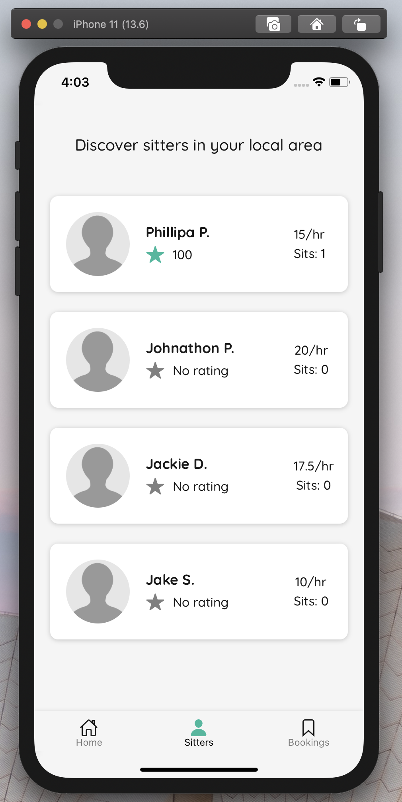
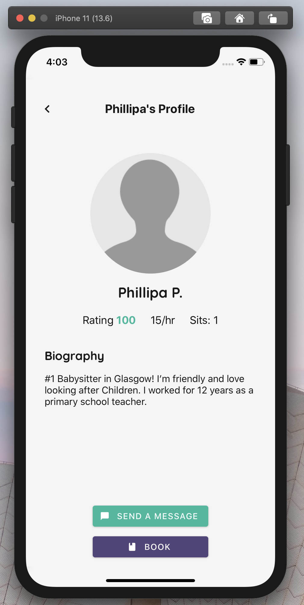
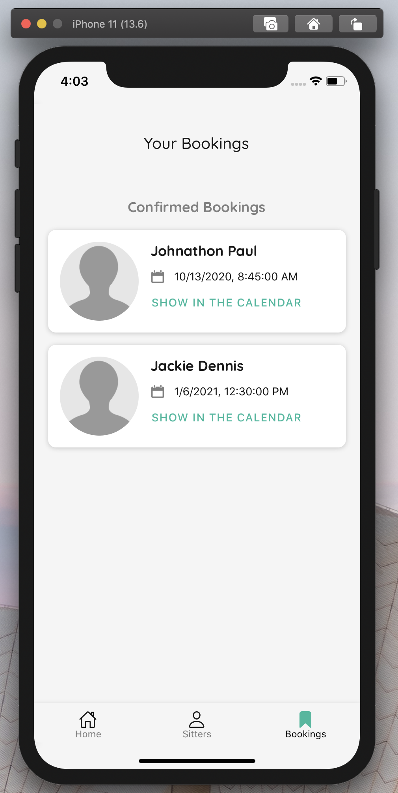

# Bubble app

<div style="display: grid; grid-template-columns: 250px 250px 250px; grid-gap: 20px; margin-bottom: 20px;">
  
  
  
  
  
</div>

# Setup

Before everything you should setup the project.

Run `yarn install` to install all the dependencies. <br/>
Modify [config.json](./src/config.json) file, and update the api endpoint

``` json
{
  "api": {
    "url": "http://your-api-url-here.com/"
  }
}
```

# Running the application

``` bash
yarn install
```

### Running on IOS
``` bash
yarn ios
```

### Running on Android
``` bash
yarn android
```

# Todo

- [ ] Theme switch button
- [ ] Write tests
- [ ] Profile page
- [ ] Improve UI layout
- [ ] Registration page